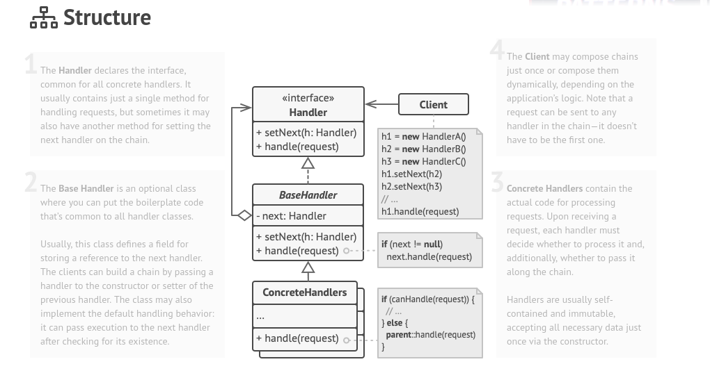

## Creational - Chain of Responsability

**Chain of Responsibility** is a behavioral design pattern that lets you pass requests along a chain of handlers. Upon receiving a request, each handler decides either to process the request or to pass it to the next handler in the chain.

### Structure

### How to Implement

1. Declare the handler interface and describe the signature of a method for handling requests.

2. Decide how the client will pass the request data into the method. The most flexible way is to convert the request into an object and pass it to the handling method as an argument.

3. To eliminate duplicate boilerplate code in concrete handlers, it might be worth creating an abstract base handler class, derived from the handler interface.

4. This class should have a field for storing a reference to the next handler in the chain. Consider making the class immutable. However, if you plan to modify chains at runtime, you need to define a setter for altering the value of the reference field.

5. You can also implement the convenient default behavior for the handling method, which is to forward the request to the next object unless there’s none left. Concrete handlers will be able to use this behavior by calling the parent method.

6. One by one create concrete handler subclasses and implement their handling methods. Each handler should make two decisions when receiving a request:
    * Whether it’ll process the request.
    * Whether it’ll pass the request along the chain.

7. The client may either assemble chains on its own or receive pre-built chains from other objects. In the latter case, you must implement some factory classes to build chains according to the configuration or environment settings.

8. The client may trigger any handler in the chain, not just the first one. The request will be passed along the chain until some handler refuses to pass it further or until it reaches the end of the chain.

9. Due to the dynamic nature of the chain, the client should be ready to handle the following scenarios:
    * The chain may consist of a single link.
    * Some requests may not reach the end of the chain.
    * Others may reach the end of the chain unhandled.
