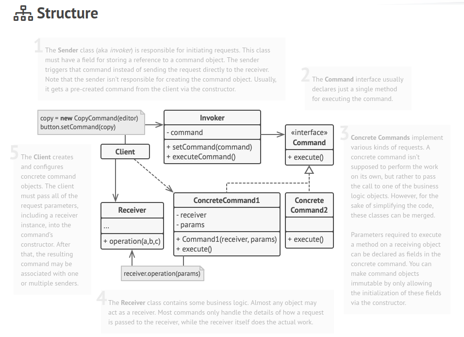

## Behavioral - Command

**Command** is a behavioral design pattern that turns a request into a stand-alone object that contains all information about the request. This transformation lets you pass requests as a method arguments, delay or queue a request’s execution, and support undoable operations.

### Structure

### How to Implement

1. Declare the command interface with a single execution method.

2. Start extracting requests into concrete command classes that implement the command interface. Each class must have a set of fields for storing the request arguments along with a reference to the actual receiver object. All these values must be initialized via the command’s constructor.

3. Identify classes that will act as senders. Add the fields for storing commands into these classes. Senders should communicate with their commands only via the command interface. Senders usually don’t create command objects on their own, but rather get them from the client code.

4. Change the senders so they execute the command instead of sending a request to the receiver directly.

The client should initialize objects in the following order:
 * Create receivers.
 * Create commands, and associate them with receivers if needed.
 * Create senders, and associate them with specific commands.
