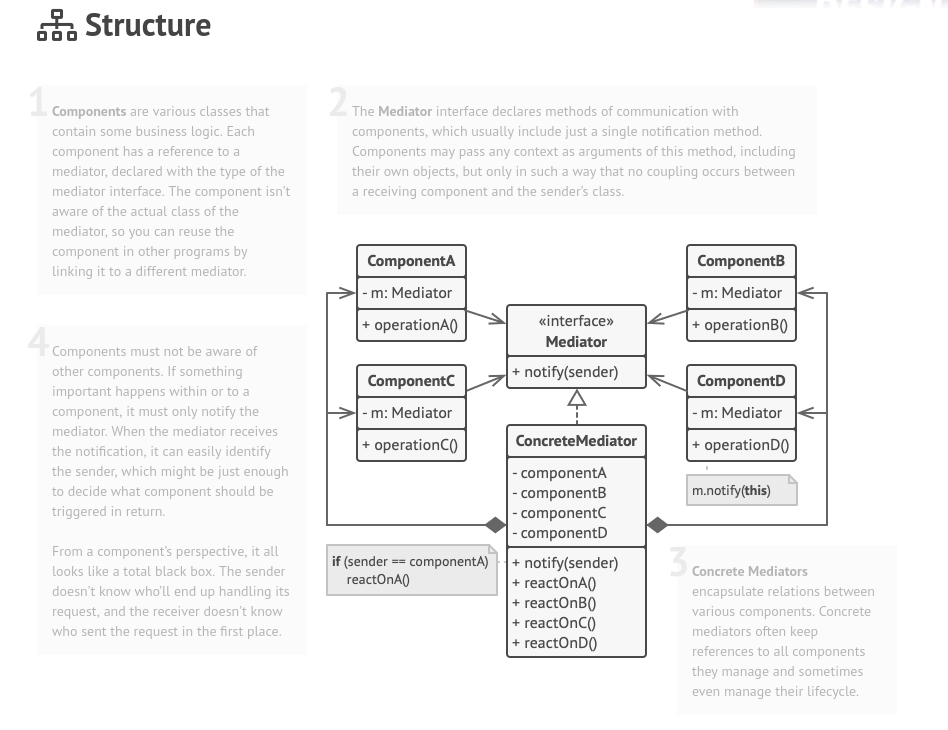

## Behavioral - Mediator

**Mediator** is a behavioral design pattern that lets you reduce chaotic dependencies between objects. The pattern restricts direct communications between the objects and forces them to collaborate only via a mediator object.

### Structure

### How to Implement

1. Identify a group of tightly coupled classes which would benefit from being more independent (e.g., for easier maintenance or simpler reuse of these classes).

2. Declare the mediator interface and describe the desired communication protocol between mediators and various components. In most cases, a single method for receiving notifications from components is sufficient.

3. This interface is crucial when you want to reuse component classes in different contexts. As long as the component works with its mediator via the generic interface, you can link the component with a different implementation of the mediator.

4. Implement the concrete mediator class. Consider storing references to all components inside the mediator. This way, you could call any component from the mediator’s methods.

5. You can go even further and make the mediator responsible for the creation and destruction of component objects. After this, the mediator may resemble a factory or a facade.

6. Components should store a reference to the mediator object. The connection is usually established in the component’s constructor, where a mediator object is passed as an argument.

7. Change the components’ code so that they call the mediator’s notification method instead of methods on other components. Extract the code that involves calling other components into the mediator class. Execute this code whenever the mediator receives notifications from that component.
