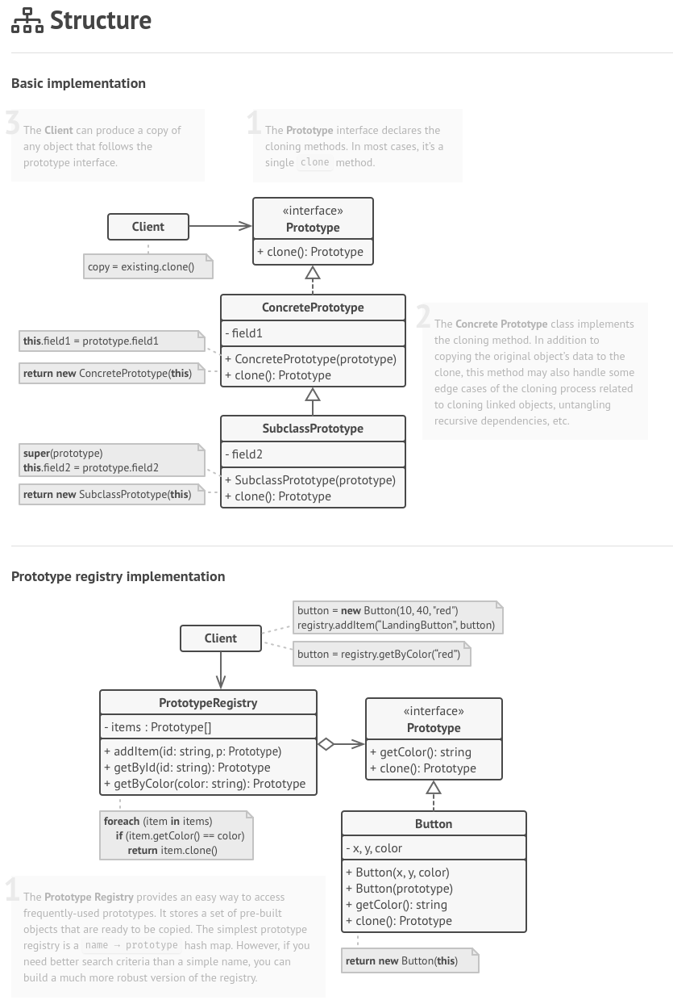

## Creational - Prototype

**Prototype** is a creational design pattern that lets you copy existing objects without making your code dependent on their classes.

### Structure

### How to Implement

1. Create the prototype interface and declare the clone method in it. Or just add the method to all classes of an existing class hierarchy, if you have one.

2. A prototype class must define the alternative constructor that accepts an object of that class as an argument. The constructor must copy the values of all fields defined in the class from the passed object into the newly created instance. If you’re changing a subclass, you must call the parent constructor to let the superclass handle the cloning of its private fields.

3. If your programming language doesn’t support method overloading, you won’t be able to create a separate “prototype” constructor. Thus, copying the object’s data into the newly created clone will have to be performed within the clone method. Still, having this code in a regular constructor is safer because the resulting object is returned fully configured right after you call the new operator.

4. The cloning method usually consists of just one line: running a new operator with the prototypical version of the constructor. Note, that every class must explicitly override the cloning method and use its own class name along with the new operator. Otherwise, the cloning method may produce an object of a parent class.

5. Optionally, create a centralized prototype registry to store a catalog of frequently used prototypes.

6. You can implement the registry as a new factory class or put it in the base prototype class with a static method for fetching the prototype. This method should search for a prototype based on search criteria that the client code passes to the method. The criteria might either be a simple string tag or a complex set of search parameters. After the appropriate prototype is found, the registry should clone it and return the copy to the client.

7. Finally, replace the direct calls to the subclasses’ constructors with calls to the factory method of the prototype registry.

