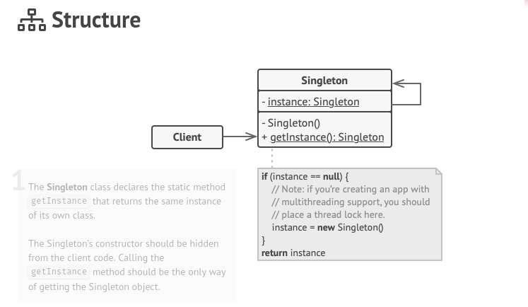

## Creational - Singleton

**Singleton** is a creational design pattern that lets you ensure that a class has only one instance, while providing a global access point to this instance.

## Structure

