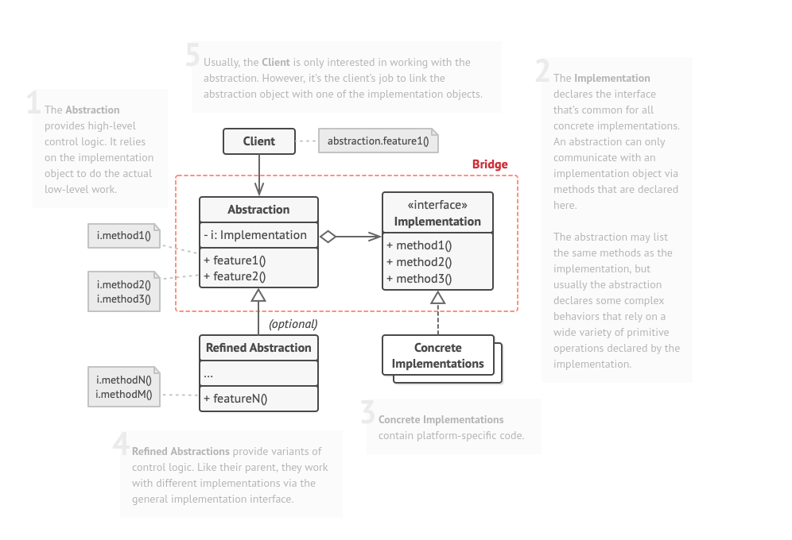

## Structural - Bridge

**Bridge** is a structural design pattern that lets you split a large class or a set of closely related classes into two separate hierarchies—abstraction and implementation—which can be developed independently of each other.  
One of these hierarchies (often called the Abstraction) will get a reference to an object of the second hierarchy (Implementation). The abstraction will be able to delegate some (sometimes, most) of its calls to the implementations object. Since all implementations will have a common interface, they’d be interchangeable inside the abstraction.

### Structure

### How to Implement
1. Identify the orthogonal dimensions in your classes. These independent concepts could be: abstraction/platform, domain/infrastructure, front-end/back-end, or interface/implementation.

2. See what operations the client needs and define them in the base abstraction class.

3. Determine the operations available on all platforms. Declare the ones that the abstraction needs in the general implementation interface.

4. For all platforms in your domain create concrete implementation classes, but make sure they all follow the implementation interface.

5. Inside the abstraction class, add a reference field for the implementation type. The abstraction delegates most of the work to the implementation object that’s referenced in that field.

6. If you have several variants of high-level logic, create refined abstractions for each variant by extending the base abstraction class.

7. The client code should pass an implementation object to the abstraction’s constructor to associate one with the other. After that, the client can forget about the implementation and work only with the abstraction object.
