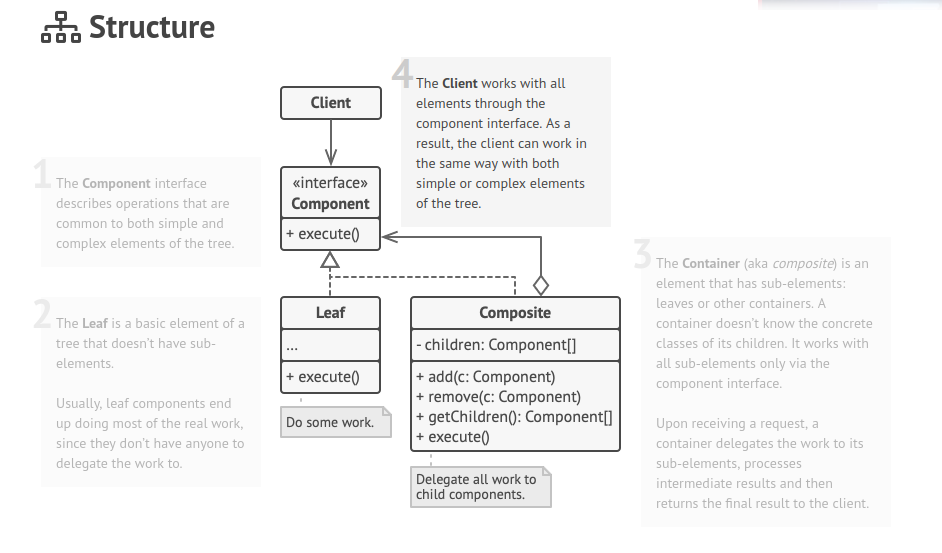

## Structural - Composite

**Composite** is a structural design pattern that lets you compose objects into tree structures and then work with these structures as if they were individual objects.

## Structure
